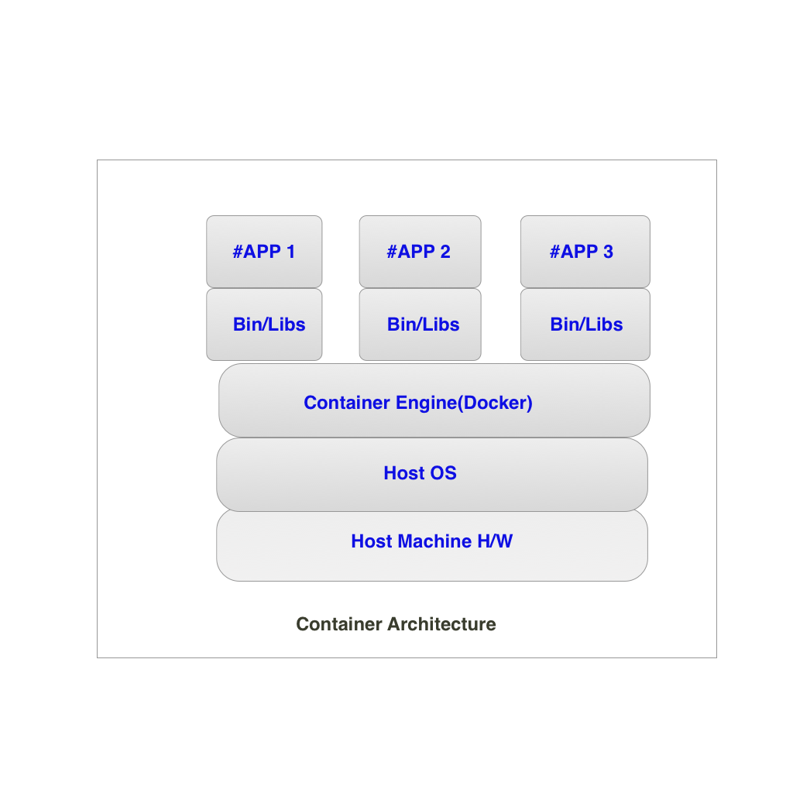

## Introduction

VM provides hardware virtualization, but a container provides operating system level virtualization by abstracting the **user space**.

For all intent and purposes, containers look like a VM. They have private space for processing, can execute commands as root, have a private network interface and IP address, allow custom routes and iptable rules, can mount file systems, etc.

The one big difference between containers and VMs is that containers **share** the host system's kernel with other containers.

As you can see from the diagram, there is no hypervisor, so no hardware virtualization. The only parts that are created from scratch is bins and libs. This is what makes containers so lightweight. .and Awesome 😄.

