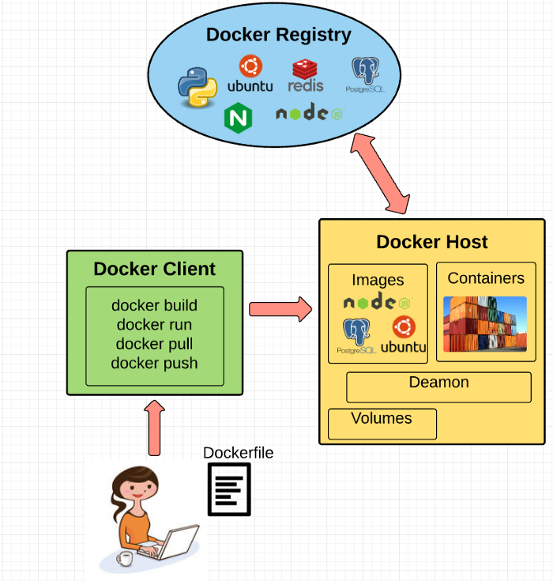
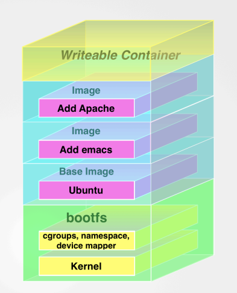
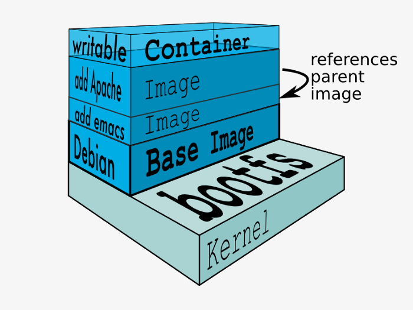

### Docker Engine

Lightweight runtime and tooling environment that manages containers, images, builds, and more.

It runs natively on Linux Systems and is made of:

- A Docker Daemon that runs in the host computer
- A Docker client that communicates with the Docker Daemon to execute commands.
- A REST API for interacting with the Docker Daemon remotely.

### Docker Client

The Docker Client is what you, as the end-user of Docker, communicate with.

### Docker Daemon

The Docker daemon is what actually executes commands sent to the Docker Client - Like building, running, and distributing your containers.

### Docker Image

Images are read-only templates that you build from a set of instructions written in your Dockerfile. Images define both what you want your packaged application and its dependencies to look like and what processes to run when its launched.

The Docker image is built using a Dockerfile. Each instruction in the Dockerfile adds a new "layer" to the image, with layers representing a portion of the images file system that either adds to or replaces the layer below it. Layers are key to Docker's lightweight yet powerful structure. Docker uses a Union File System to achieve this.

### Docker Containers

If you consider your Docker Image as a Class in JavaScript. then docker container can be considered an Object created from that class 😃

Well this analogy is not 100% correct but this helps with creating a mental modal for Containers.

A docker container wraps an application's software into an invisible box with everything the application needs to run. That includes the operating-system, application code, runtime, system tools, system libraries, and etc. Docker containers are built off docker images. Since images are read-only, Docker adds a read-write file system over the read-only file system of the image to create a container.

### Volumes

Volumes are the "data" part of the container, initialized when a container is created. Volumes allow you to persist and share a container's data. Data volumes are separate from the default Union File System and exist as normal directories and files on the host filesystem.

