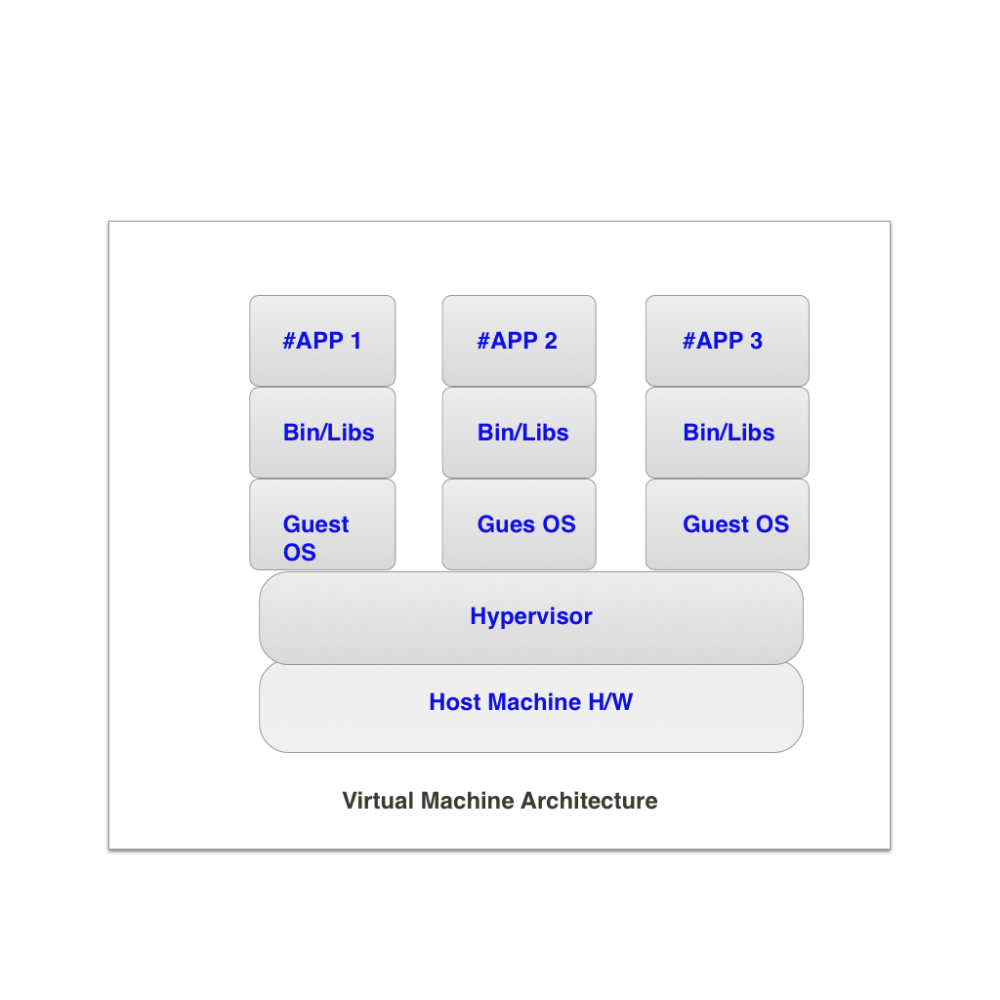

Let's go back in time to understand how the production system was working in the early days of World Wide Web. Suppose you are a Head of Engineering of a fancy startup called Nest-o 😄, Website that allows you to rent a home in any city in India.
 
Lets see how you would have deployed your site back then. You either purchase a bunch of CPU and Memory and setup the servers on your own **or** you rent the server. you go to Dell or EMC, which at that time provided facility to rent the servers. you go in their server farm, setup a machine, put your code there and run the server. 

Well, this process is not very good. this has a lot of shortcomings. 

- Your machine resources are not optimised properly.
- This is not scalable. Let say you have a big day coming, right?. 10 days before IIT batches start in Kota. which is basically a hub for IIT aspirants. Everybody is looking for a nice play to stay there. and they learn about your company.
What you do is you go back again to Dell and EMC and rent a bigger machine. machine with more CPU and memory capability. you migrate your entire server from the previous machine to this machine.
Well, you got the point right. this is so prone to errors. this just doesn't feel good.

So What do we do? We look for solutions. and We invent a better alternative. I mean that's what we humans do.

## Virtual Machine

A Virtual machine or VM is essentially an emulation of a real computer that executes programs like a real computer. VMs run on top of physical machines using a "hypervisor". A hypervisor, in turn, runs on either a host machine or on "bare-metal".

There are a lot of Jargons in this. Let's unpack them. 

### Hypervisor 

An hypervisor is software that creates and runs Virtual Machines. A hypervisor allows one host computer to support multiple Guest VM by sharing its resources, such as memory and processing.

Well there are two types of Hypervisors:

1. Type 1 Hypervisor
2. Type 2 Hypervisor

A Type 1 Hypervisor acts like a light-weight operating system and runs directly on the host machine hardware.

A Type 2 Hypervisor runs as a software layer on an operating system, like other computer programs. It is also known as Hosted Hypervisor.

The underlying physical machine is called "Host Machine" and the virtual machine emulated on that machine is generally referred as the "Guest Machine".

